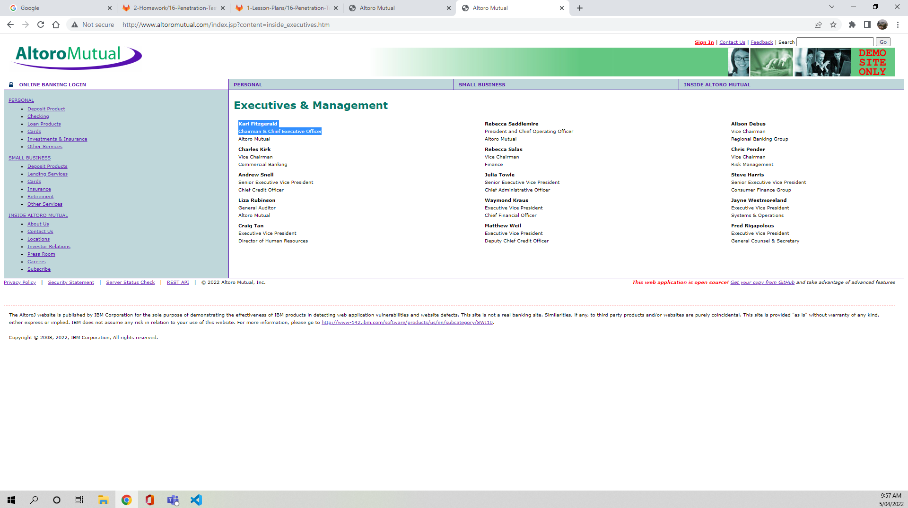

## Week 16 Homework Submission File: Penetration Testing 1

#### Step 1: Google Dorking

- Using Google, can you identify who the Chief Executive Officer of Altoro Mutual is:
  Karl Fitgerald- Chairman & Chief Executive Officer
  

- How can this information be helpful to an attacker:
  Threat Actor could use this details to perform social enginerring attacks on the CEO to access to sensitive company information.

#### Step 2: DNS and Domain Discovery

Enter the IP address for `demo.testfire.net` into Domain Dossier and answer the following questions based on the results:

  1. Where is the company located: Sunnyvale CA

  2. What is the NetRange IP address: 65.61.137.64 - 65.61.137.127

  3. What is the company they use to store their infrastructure: Rackspace Backbone Engineering

  4. What is the IP address of the DNS server: 65.61.137.117

#### Step 3: Shodan

- What open ports and running services did Shodan find:
Port 80/TCP
Port 443/TCP
Port 8080/TCP
Services: Apache Tomcat/Coyote JSP engine ver 1.1

#### Step 4: Recon-ng

- Install the Recon module `xssed`. 
- Set the source to `demo.testfire.net`. 
- Run the module. 

Is Altoro Mutual vulnerable to XSS: 
 Yes

### Step 5: Zenmap

Your client has asked that you help identify any vulnerabilities with their file-sharing server. Using the Metasploitable machine to act as your client's server, complete the following:

- Command for Zenmap to run a service scan against the Metasploitable machine: nmap -T4-F --script ftp-vsftpd-backdoor 192.168.0.10
 
- Bonus command to output results into a new text file named `zenmapscan.txt`: 

- Zenmap vulnerability script command: nmap -p 139,445 --script=smb-enum-shares 192.168.0.10

- Once you have identified this vulnerability, answer the following questions for your client:
  1. What is the vulnerability:
     CVE-2011-2523
     the target machine is running Samba 3.0.20-debian which makes it vulnerable.

  2. Why is it dangerous:
    This allow remote attacker to execute arbitiory code on target machines.

  3. What mitigation strategies can you recommendations for the client to protect their server:
     Should be running updated Samba version with latest patch.

---
© 2020 Trilogy Education Services, a 2U, Inc. brand. All Rights Reserved.  

