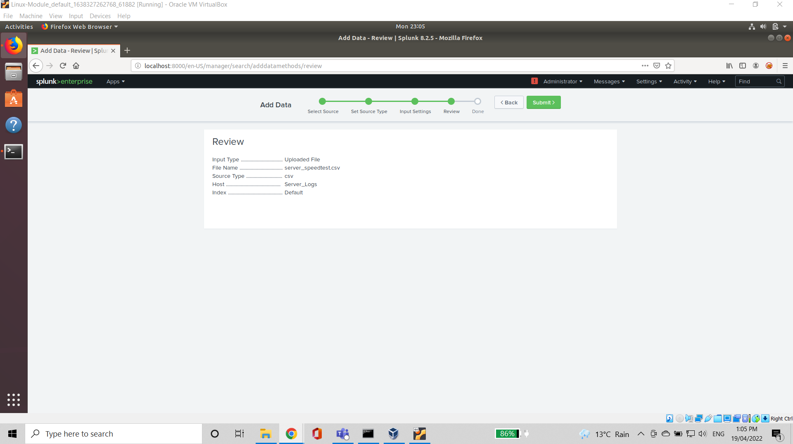
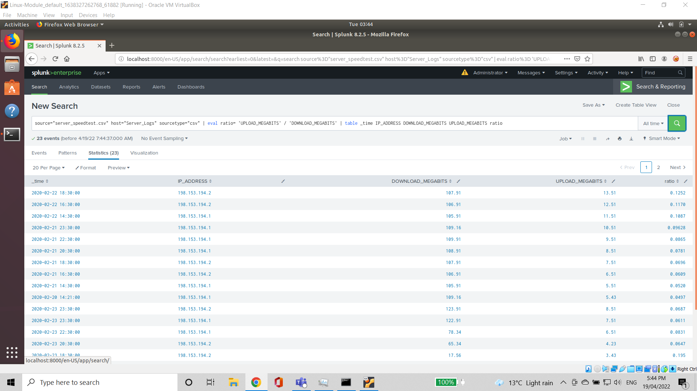
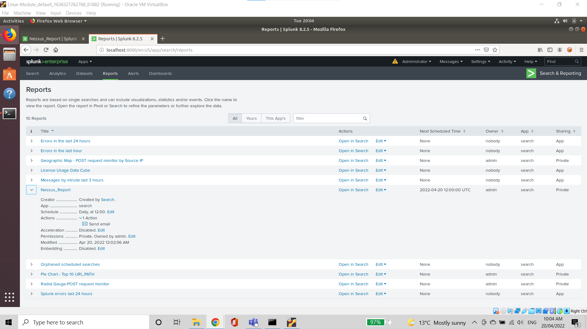
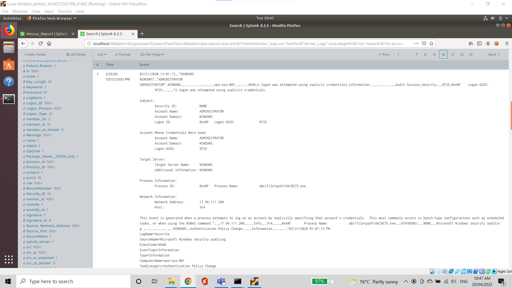
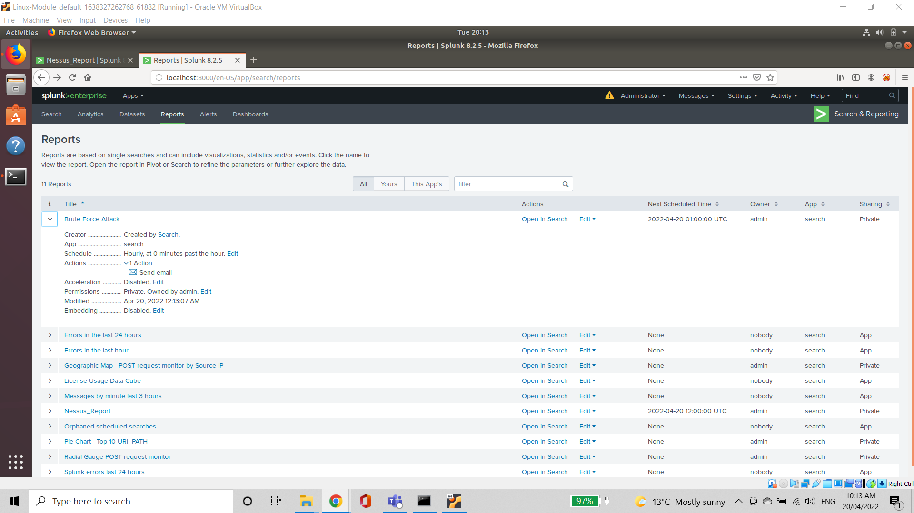

Step 1: 
Upload the following file of the system speeds around the time of the attack.

Speed Test File
 
 

Answer the following questions:

Based on the report created, what is the approximate date and time of the attack?

-It occured approximately 14:30 on February 23, 2020. 

How long did it take your systems to recover?

-Systems recovered and were operating normally by 23:00 on February 23, 2020,recovery time of 8 hours and 30 minutes.

Step 2:

Nessus Scan Results
 
 
 Proof the alert has been created:
 

Step 3: Drawing the (base)line

Admin Logins

When did the brute force attack occur?

-The attack occurred between 9:00 AM and 1:00 PM on February 21, 2020.

Proof the alert has been created:

